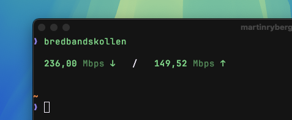
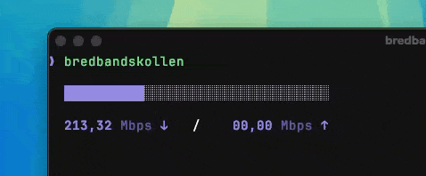

# bredbandskollen-cli

Measure your internet speed from the command line using Bredbandskollen.



## Install

```bash
$ npm install -g bredbandskollen-cli
```

## CLI

```
Usage
	  $ bredbandskollen

	Options
		--json  JSON output

	Examples
	  $ bredbandskollen --json
```



## License

This project is licensed under the European Union Public License (EUPL) version 1.2. The EUPL is a copyleft free software license that allows for the use, modification, and distribution of the software while ensuring that derivative works are also distributed under the same license terms. For more details, please see the [EUPL 1.2 license text](https://joinup.ec.europa.eu/collection/eupl/eupl-text-eupl-12).
